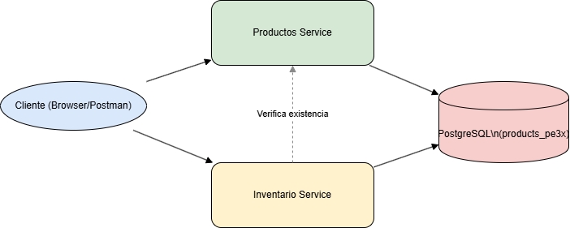
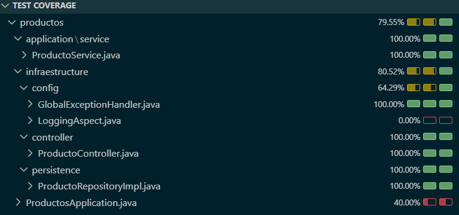

# Microservicio de Productos

Este microservicio gestiona los productos disponibles en el sistema de inventario. Permite registrar, consultar y listar productos. Es consumido por el microservicio de inventarios para validar y obtener detalles de los productos asociados a inventarios.

---

## 🔧 1. Instrucciones de instalación y ejecución

### Requisitos previos

- Java 17
- Maven 3.8+
- Docker (opcional)
- PostgreSQL (o usar la base remota de pruebas en Render)

### Ejecución local

1. Clonar el repositorio

```bash
git clone https://github.com/smar05/linktic-products
cd linktic-productos
```

2. Configurar variables de entorno

Variables de entorno: se dejan variables de entorno con conexion a la base de datos remota en Render para pruebas, tambien se puede usar el ambiente de 'dev' pya configurado con dichas variables

```bash
DB_URL=jdbc:postgresql://dpg-d1tgrp2dbo4c73dj28v0-a.oregon-postgres.render.com/products_pe3x  DB_USERNAME=user
DB_PASSWORD=jWQPPUeBEmN5lGxvwwVSbeOQvDid4n8U
```

3. Compilar y ejecutar

```bash
mvn clean install
java -jar target/productos-0.0.1-SNAPSHOT.jar
```

## Ejecución con Docker

```bash
docker build -t smar05/linktic-productos .
docker run -d -p 8081:8080 --name productos-service -e DB_URL="jdbc:postgresql://dpg-d1tgrp2dbo4c73dj28v0-a.oregon-postgres.render.com/products_pe3x" -e DB_USERNAME="user" -e DB_PASSWORD="jWQPPUeBEmN5lGxvwwVSbeOQvDid4n8U"  smar05/linktic-productos:latest
```

Imagen en Docker Hub:
https://hub.docker.com/r/smar05/linktic-productos

## Arquitectura

Se utilizó arquitectura hexagonal (puertos y adaptadores) para separar las reglas de negocio (dominio) de las capas de infraestructura y controladores.

```bash
└── com.linktic.productos
    ├── application.service        # Lógica de negocio
    ├── domain.model              # Modelos del dominio
    ├── domain.ports              # Interfaces de entrada/salida
    ├── infrastructure.controller  # Controladores REST
    ├── infrastructure.persistence # Adaptador JPA (BD)
    ├── infrastructure.config      # Logs, Swagger, errores, etc.
```

## Decisiones técnicas

La lógica de compra se implementó en el microservicio de Inventarios, debido a que:

- Es responsable de validar la existencia y cantidad de inventario.

- Realiza el descuento de unidades.

- Mantiene la coherencia de los datos del inventario.

👉 El microservicio de productos solo sirve como fuente de verdad para los datos del producto (nombre, descripción, precio).

### Otras decisiones

- Java 17 + Spring Boot 3.

- Swagger/OpenAPI.

- Logs automáticos con AOP (@Aspect) para trazabilidad.

- Docker: despliegue multiplataforma.

- Base de datos remota (Render) para facilitar las pruebas sin local setup.

## Diagrama de interacción entre servicios



El microservicio de inventarios consulta a productos para verificar si el producto existe y obtener sus datos antes de operar sobre su inventario.

## Flujo de compra

1. Cliente envía una solicitud POST /compras al microservicio de inventarios.

2. Inventarios valida si el producto existe consultando a GET /productos/{id}.

3. Si el producto existe, busca el inventario disponible.

4. Si hay stock suficiente, descuenta la cantidad y retorna el nuevo estado.

5. Si no hay disponibilidad o el producto no existe, se lanza error con 400.

## Pruebas

Las pruebas se ejecutan con:

```bash
mvn test
```

Tecnologías:

- JUnit 5

- Mockito

- Spring Boot Test



## Despliegue online

La imagen dodker del proyecto se desplego en el servicio en la nube Render y es accesible mediante la siguiente url (Inicialmente puede demorarse las consultas ya que al ser un plan gratuito se apagan los servidores):

https://linktic-productos.onrender.com

## Documentación Swagger

https://linktic-productos.onrender.com/swagger-ui/index.html#/

## Health Check

https://linktic-productos.onrender.com/actuator/health

## API

POST: Permite crear un nuevo producto

```bash
curl --location 'https://linktic-productos.onrender.com/productos' \
--header 'Content-Type: application/json' \
--data '{
    "nombre": "Chaqueta hombre",
    "precio": 50.23,
    "descripcion": "Talla M"
  }'
```

GET: Permite consultar un producto por su ID

```bash
curl --location 'https://linktic-productos.onrender.com/productos/1'
```

GET: Permite consultar todos los productos presentes

```bash
curl --location 'https://linktic-productos.onrender.com/productos'
```

GET: Chek status

```bash
curl --location 'https://linktic-productos.onrender.com/actuator/health'
```

## Autor

Desarrollado por: Ricardo Mantilla
mantillasanchezr@gmail.com
github.com/smar05
